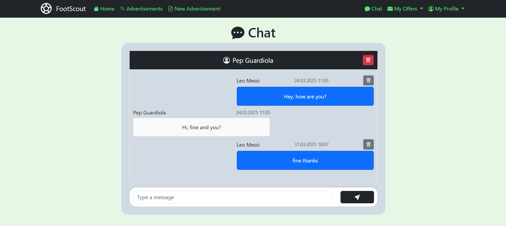
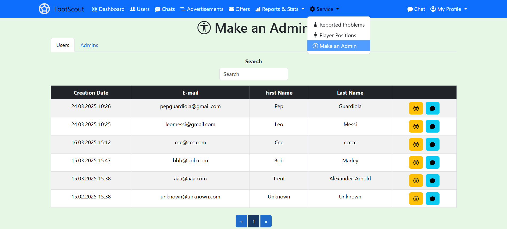

# FootScout

## About project
The project is a web application presenting a complex platform for managing football transfers. The application allows players to search for football clubs and clubs to search for players for specific positions of a football team. The system solves a problem related to the lack of a tool to facilitate the effective management of football transfers at different levels of the world's competition. To date, player transfers were mainly carried out through telephone contact, which did not provide an adequate level of organization. The application aims to improve players' skills through proper club selection and thus improve the quality of the game in the world's most popular sport. To check the quality of the software, unit tests tests have been conducted using xUnit tool.

The project was built using **Vue** & **ASP.NET Core Web API** & **MS SQL**.

Other versions of the project:
- **React** & **ASP.NET Core Web API** & **MS SQL**: https://github.com/karoldziadkowiec/FootScout
- **React** & **ASP.NET Core Web API** & **PostgreSQL**: https://github.com/karoldziadkowiec/FootScout-PostgreSQL
- **React** & **ASP.NET Core Web API** & **MongoDB**: https://github.com/karoldziadkowiec/FootScout-MongoDB

## Construction and communication of application
- Application type: **web application**
- Architecture: **client-server**
- Communication:
    - **REST API** 
    - real-time communication (**SignalR**)

## Technologies
### Backend (server)
- **ASP.NET Core Web API** (.NET 8.0)
- **C#** (12.0)
    - asynchronous programming (async/await)
    - authentication (**JWT Bearer**), authorization with roles, policies
    - real-time communication between users (**SignalR**)
    - Dependency Injection, DTO, Controller, Service, Repository patterns
    - configuration management with file *appsettings.json*
    - application's seeder during the initial launch
    - password hashing
    - mapping profiles
    - LINQ queries
- Database system: 
    - **Microsoft SQL Server**
        - **15** tables (one-to-many relationship)
- ORM: 
    - **Entity Framework Core**
        - Migrations
- Main libraries:
    - **SignalR**
    - **AspNetCore.Authentication.JwtBearer**
    - **AutoMapper**
    - **ClosedXML**
- Unit tests: 
    - **xUnit**
- API tested by:
    - **Swagger UI**
    - **Postman**

### Frontend (client)
- **Vue** (3.5.13)
    - **TypeScript** (5.7.2)
        - asynchronous programming (async/await)
        - authentication (**JWT Bearer**), authorization with roles, cookies management
        - real-time communication between users (**microsoft/signalR**)
        - Service, Modal, Pagination, Routing patterns
        - using ref/onMounted
    - **HTML**
    - **CSS**
    - Main libraries:
        - **bootstrap, bootstrap-icons** components
        - **vue-toast-notification**
        - **vue-chart-3** and **chart.js**
        - **vue-router**
        - **axios**
        - **microsoft/signalr**
        - **jwt-decode**
        - **js-cookie**
        - **vue-scrollto**
        - **date-fns**

## Roles (actors) of the application
- Observer
- User
- Admin

## Main features
- **Observer**: login and account registration.
- **User**: account management, managing club histories, creating player advertisements, managing player advertisements, following advertisements, managing club offers, reporting application problems, managing chats, chatting with users in real time, logging out.
- **Admin**: management of users, chats, player advertisements, club offers, raporting data of user, chats, player advertisements, club offers, chatting with users in real time, reporting and managing application problems, adding new player position, adding/removing an admin, logging out.

## Images
Login page:

Registration page:

Home page:

My profile page:

Club History page:

Creating new player advertisement:

Displaying all player advertisements:

Displaying specific player advertisement with following:

Submitting a club offer:

Displaying all received club offers:

Displaying offer details:

Accepting an offer:

Chat rooms:

Real-time chatting with a selected user:

Reporting a problem connected with web app:

Admin home page:

Users page for admin:

Player advertisements page for admin:

Player advertisements - raports & stats page for admin:

Admin page for adding new admin:

### Mobile version of web app

Login page:

Chat page:

Admin home page:

### Database schema

### Unit tests results

